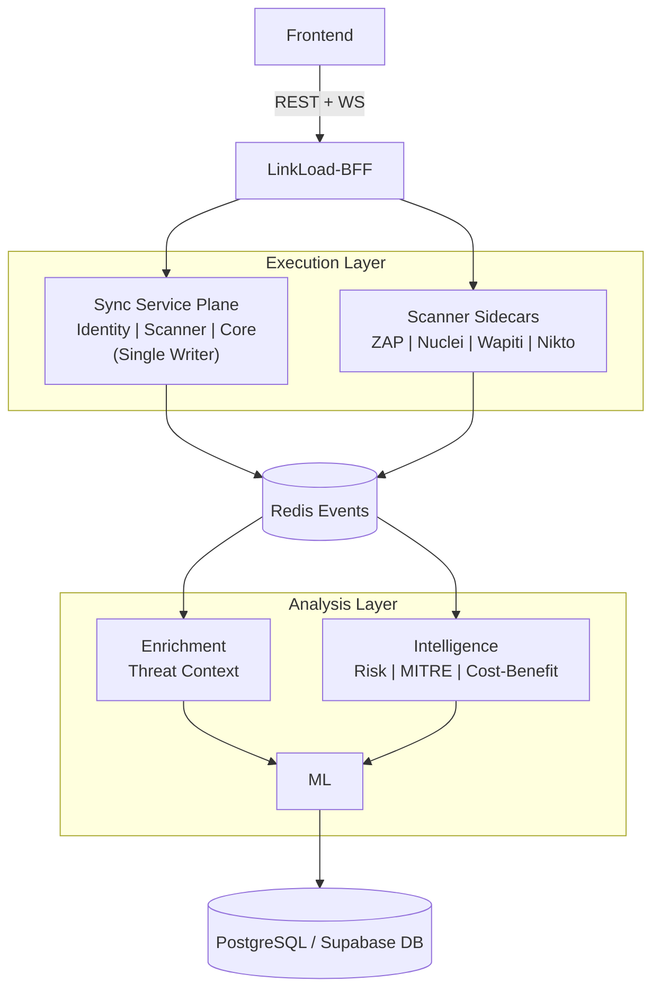

# LINKLOAD

## Tactical Web Security Reconnaissance Platform

<div align="center">

```
   
                                                     
▄▄▄                       ▄▄▄                     ▄▄ 
███      ▀▀        ▄▄     ███                     ██ 
███      ██  ████▄ ██ ▄█▀ ███      ▄███▄  ▀▀█▄ ▄████ 
███      ██  ██ ██ ████   ███      ██ ██ ▄█▀██ ██ ██ 
████████ ██▄ ██ ██ ██ ▀█▄ ████████ ▀███▀ ▀█▄██ ▀████ 
                                                                       
                                                                                 
[ CYBER RECONNAISSANCE & THREAT ANALYSIS SYSTEM ]
```

</div>

[](LICENSE)
[](https://www.python.org/)
[](https://fastapi.tiangolo.com/)
[](https://react.dev/)
[](https://www.docker.com/)
[]()
[]()

---

## Mission Brief

Security teams rarely lose because they lack tools.
They lose because noise arrives faster than signal.

LinkLoad is built as a tactical command platform for web reconnaissance. It coordinates scanner units, fuses findings with intelligence, maps risk to MITRE ATT&CK, and delivers one operational picture through a single gateway.

If your team needs fast detection and clear prioritization under pressure, this stack is designed for that exact battlefield.

---


## Operational Objectives

1. Launch scanners in parallel and reduce mission time.
2. Keep frontend simple: one gateway, one contract.
3. Preserve data integrity with a single-writer Core model.
4. Provide live mission feedback with WebSocket notifications and polling fallback.

---

## Command Topology



### Rules of the Battlespace

- Frontend talks only to BFF 
- BFF routes auth to Identity and scan write/read paths to Scanner/Core.
- Redis carries cross-service event traffic.
- Core remains the authoritative persistence coordinator.


---

## Mission Flow

1. Operator starts a scan from the frontend.
2. BFF forwards command traffic to the Scanner orchestrator.
3. Scanner fan-outs to ZAP, Nuclei, Wapiti, and Nikto.
4. Progress and completion events are published to Redis.
5. Enrichment and Intelligence consume events and add context.
6. ML lane can consume downstream events for advanced inference.
7. Core assembles normalized results and persists records.
8. Frontend receives updates through polling and optional WS notifications.

---


## Real-Time Command Channel

BFF exposes notification WebSocket routes:

- /ws/scans/{scan_id}
- /ws/scans/{scan_id}/progress
- /ws/scans/{scan_id}/events

Progress and results are always available through polling-safe endpoints:

- /api/v1/scans/comprehensive/{scan_id}/status
- /api/v1/scans/comprehensive/{scan_id}/result

---

## Repository Battalions

- linkload-bff: gateway and API policy layer
- linkload-core: persistence and aggregation command center
- linkload-identity: identity and access control service
- linkload-scanner: orchestrator and scanner sidecars
- linkload-enrichment: async intelligence enrichment
- linkload-intelligence: risk and MITRE analysis
- linkload-ml: machine learning service lane
- linkload-frontend: operator dashboard
- linkload-devops: primary compose and runtime wiring
- monitoring-service: metrics, logs, dashboards
- shared_events: event models and bus utilities
- linkload-docs: architecture and implementation guides

---

## Security and Rules of Engagement

- Scan only targets you own or are formally authorized to assess.
- Never expose private secrets through frontend variables.
- Use hardened secrets, strict CORS, and TLS for non-dev environments.
- Keep Supabase RLS policies enabled and reviewed.

---

## Field Manuals

- Platform architecture and deep dives: linkload-docs/
- Core API and technical references: linkload-core/docs/
- Service-level notes: each service folder README and docs

---

## License

Released under the MIT License.

## Credits

Architected by Prateek Shrivastava ([@pratiyk](https://github.com/pratiyk))
